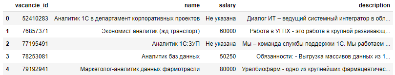
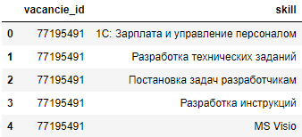
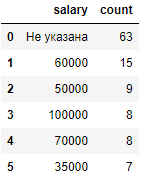
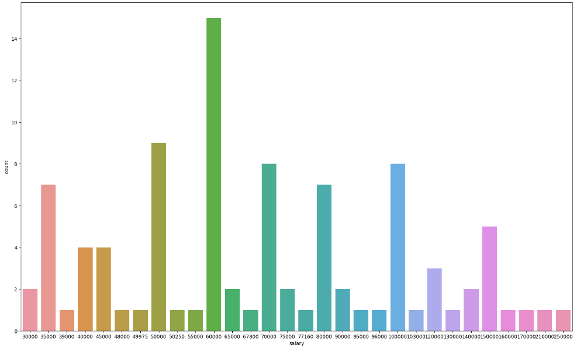
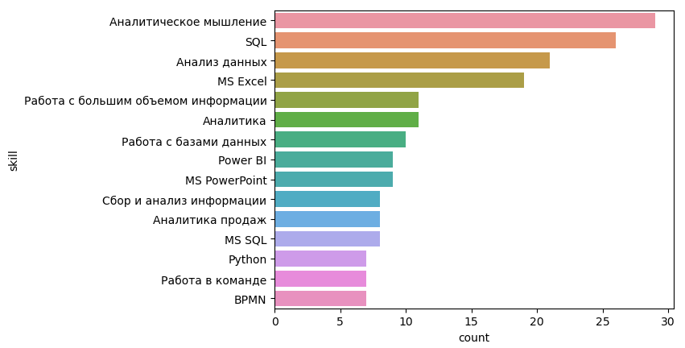

<h1 align="center"> Парсинг вакансий с hh.ru и анализ данных вакансий </h1>

**Идея:** Скрипт автоматизирует поиск вакансий с сайта HeadHanter, с помощью библиотек Python. Для доступа к данным вакансии используется API hh.ru. Скрипт собирает данные из вакансий, отобранных, по заданным параметрам. На основе полученных данных делаются выводы о наиболее востребованых навыках на рынке и о распределении зарплат

*Код работает на Python v.3.11.3* :snake:

Пример полученного отчета:



**Импортируем библиотеки**
```python
import requests
import json
import time
import os
import pandas as pd
import re
import seaborn as sns
import matplotlib.pyplot as plt
```
**Cоздаем функцию для получения данных со страницы поиска hh c заданными парметрами**   
*В имени вакансии есть слово "аналитик", г. Екатеринбург, 100 вакансий на странице*
```python
def get_page(page=0):
    param = {'text':'NAME:Аналитик', 'area':3, 'page': page, 'per_page':100}
    r = requests.get('https://api.hh.ru/vacancies/', params=param)
    return r.text
```
**Cчитываем первые 2000 вакансий. Записываем даннные со страницы поиска hh в файл**
```python
for page in range(20):
    vac_page = json.loads(get_page(page))
#если вакансий меньше, чем 2000-остановить цикл 
    if vac_page['pages'] - page <= 1: 
        break
    file_name = 'analytics_vacancies_page_{}.json'
    file_name = file_name.format(page+1)
    with open(file_name, 'a', encoding='utf-8') as file:
        file.write(json.dumps(vac_page, ensure_ascii=False))
```
**Достаем url-адрес вакансии из файла поисковой выдачи, на каждой странице.   
Ообращаемся к API по ссылке и получаем детальную информацию по каждой вакансии.
Записываем данные вакансии в файл**
```python
for file in os.listdir('C:\\Users\\osinc\\hh_vacs\\vacs_pages'):
    with open('C:\\Users\\osinc\\hh_vacs\\vacs_pages\\{}'.format(file), 'r', encoding='utf-8') as page:
        page_read = page.read()
    pages_json = json.loads(page_read)
    for vac in pages_json['items']:
        r = requests.get(vac['url'])
        if r.status_code == 200:
            file_name = 'analytics_vacancies_{}.json'
            file_name = file_name.format(vac['id'])
            with open(file_name, 'a', encoding='utf-8') as file:
                file.write(json.dumps(json.loads(r.text), ensure_ascii=False))
    time.sleep(0.25)
```
**Вытаскиваем данные вакансии в список**
```python
ID = [] #id вакансии
names = [] #имя вакансии
descriptions = [] #описание вакансии
salary = []
skills_vac = [] #id вакансии
skills_name = [] #требуемые скилы вакансии
for file in os.listdir('C:\\Users\\osinc\\hh_vacs\\all_vacs'):
    with open('C:\\Users\\osinc\\hh_vacs\\all_vacs\\{}'.format(file), 'r', encoding='utf-8') as vacs:
        vacs_read = vacs.read()
    vacs_json = json.loads(vacs_read)
    ID.append(vacs_json['id'])
    names.append(vacs_json['name'])
    salary.append(vacs_json['salary'])
    descriptions.append(vacs_json['description'])
    for skill in vacs_json['key_skills']:
        skills_vac.append(vacs_json['id'])
        skills_name.append(skill['name'])
```
**Очищаем описание вакансии от html тегов**
```python
descriptions = list(map(lambda x:re.sub(r"<[^>]+>", "",x, flags=re.S), descriptions))
```
**Приводим данные о зарплате в нужный нам вид**
```python
def salary_return(salary):
    if salary is not None:
        if salary['from'] is None:
            return salary['to']
        else:
            return salary['from']
    else:
        return 'Не указана'
salary = list(map(salary_return,salary))
```
**Создаем датафрейм с вакансиями и датафрейм с навыками в вакансии**
```python
vacancies = pd.DataFrame({'vacancie_id': ID, 'name': names, 'salary': salary , 'description': descriptions})
skills = pd.DataFrame({'vacancie_id': skills_vac, 'skill': skills_name})
```
**Создаем датафрейм с распределением зарплат в вакансиях**
```python
vacancies_salary = vacancies.salary.value_counts().reset_index().rename(columns={'index':'salary', 'salary':'count'})
```


**Выводим данные о зарплатах**
```python
min_salary = vacancies_salary.query('salary != "Не указана"').salary.min()
max_salary = vacancies_salary.query('salary != "Не указана"').salary.max()
median_salary = vacancies_salary.query('salary != "Не указана"').salary.median()
print(f'Минимальная зарплата {min_salary} \nМаксимальная зарплата {max_salary} \nМедианная зарплата {median_salary}')

Минимальная зарплата 30000 
Максимальная зарплата 250000 
Медианная зарплата 76080.0
```
**Построим график распределения зарплат на кол-во вакансий**
```python
plt.figure(figsize=(20, 12))
sns.barplot(vacancies_salary.query('salary != "Не указана"'), x='salary', y='count')
```


**Выедем топ-15 необходимых навыков**
```python
top_15_skills = skills.skill.value_counts().head(15).reset_index().rename(columns={'index':'skill', 'skill':'count'})
sns.barplot(top_15_skills, x='count',y='skill')
```
